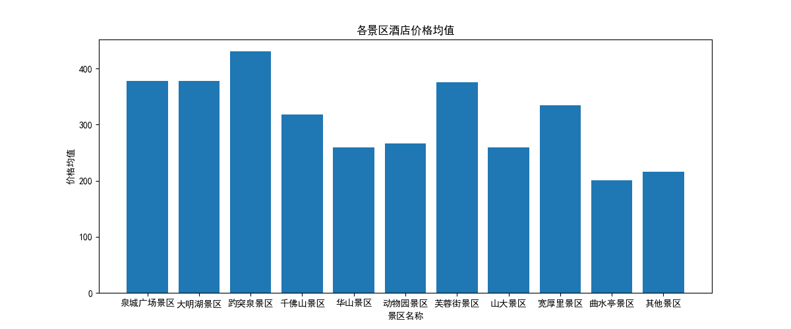
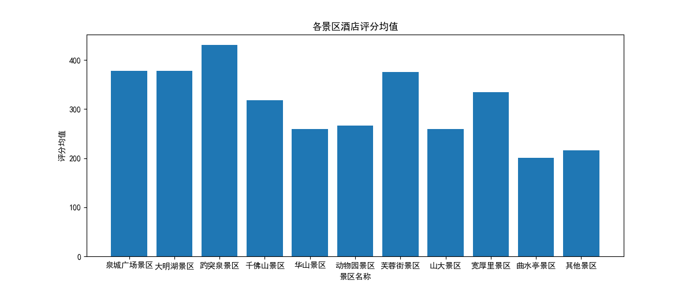
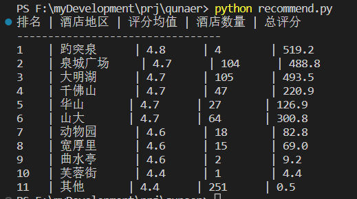
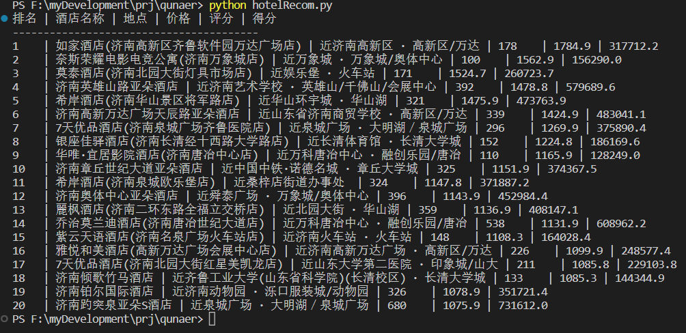

# DataProcForPython
## Introduction
- 使用```python```爬取“去哪儿”网站济南市所有酒店信息并进行数据处理，对全市近三千家酒店的评分、评论、地理位置、交通情况、价格情况进行统一分析从而得出酒店排序，最后使用完成图谱可视化、智能推荐和词云图。为用户推荐最佳性价比酒店。
- Using ```python``` to crawl all hotel information in Jinan on the "Qunar" website and carry out data processing, the ratings, reviews, geographical location, traffic conditions, and prices of nearly 3,000 hotels in the city are analyzed in a unified manner to obtain hotel rankings, and finally use the complete graph visualization, intelligent recommendation and word cloud map. Recommend the best value for money hotels for users.
## Environment
- *Python3.6* or new, *win10/win11*
- *Chromedriver.exe*
- *Pycharm+Anaconda*/*Pycharm+pip3*
- **Package:** ```pandas, jieba, matplotlib, wordcloud, selenium, webdriver, openpyxl```
## Note
1. You need to prepare ```chromedriver.exe``` to access Google browser.
2. Because the high number of crawls, the crawl time is more than ```an hour```.
3. In ```hotel.py```, you may change *username.send_keys("yourID") password.send_keys("yourPassword")* to your own ID&password.
## Usage
- ```python hotel.py``` -- Start crawling website information(long time about ```an hour```).
- ```python hotelRecom.py``` -- Used to output hotel recommendations and top 20 rankings.
- ```python recommend.py``` -- Used to output scenic spot recommendation & ranking.
- ```python resdlg.py``` -- Used to generate average price charts and score charts.
- ```python clouddlg.py``` -- Used to generate a hotel review word cloud.
## Result
- 词云图.png<br>
<br>
- 各景区酒店价格均值图.png<br>
<br>
- 各景区酒店评分均值图.png<br>
<br>
- 景区排名图.png<br>
<br>
- 酒店排名图.png<br>
<br>
## Others
- *仿宋_GB2312.ttf* -- Used for word cloud maps to display Chinese normally。